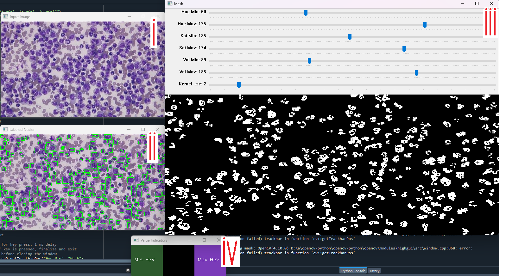
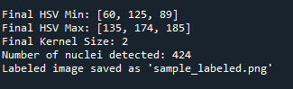

# Interactive Nucleus Counter Project

## Technical Description

This Python script utilizes OpenCV to detect and label nuclei in an image based on user-defined HSV (Hue, Saturation, Value) color ranges. It allows for real-time adjustments of these ranges through trackbars and can filter out small detected nuclei based on area.

### Features

- **Dynamic HSV Thresholding**: Users can adjust the HSV thresholds interactively using trackbars to fine-tune the detection of purple nuclei in the image.
- **Mask Cleaning Option**: The script can clean the mask using morphological operations to reduce noise, with a toggle to include or exclude small areas from the analysis.
- **Nuclei Detection**: It employs connected components analysis to identify and label each detected nucleus in the binary mask.
- **Output**: The script generates an output image with bounding boxes around detected nuclei and saves it to disk.

### Requirements

- Python 3.x
- OpenCV (`cv2`)
- NumPy

## User Guide

### Video Demonstration

[](https://youtu.be/qX7LA0Y-jfQ)

### Instructions

To run the script, ensure you have your environment set up with the required packages, and execute:

```bash
python NucleiCounter.py
```


1. You will be prompted to enter the: Image Path

2. You can either use the default values by just pressing `Enter` or input your own values.



3. A window will pop up with:
   1. The original image
   2. The Labelled Nuclei
   3. A mask selector, which will allow you to select the regions of the image that contain the nuclei, as determined by its HSV values (and a kernel size = degree of cleaning)
   4. Value Indicators indicating the max and min hsv values
   
4. Use this to adjust the mask to only include the nuclei, use the value indicators to hepl you select a valid colour range, then compare the mask and labelled nuclei against the input image
   
5. Then when the mask looks good, press `d` (for done) to continue.
   


6. In the console you will now see the  HSV Min, HSV Max, and Kernel Size values you selected (for reference) alongside the number of nuclei detected.
7. The output image will be saved in the same directory as the script with the same name as the input image but with `_labeled` appended to the name.
